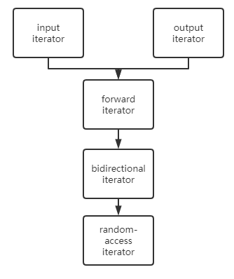

# TracySTL
A tiny C++ standard template library. Powered by ChatGPT4.


## Allocator


[allocator's code](src/allocator.h)

## Iterator



[iterator's code](src/iterator.h)

## Containers

### Sequence Containers

#### vector

[vector's code](src/vector.h)

#### list

[list's code](src/list.h)

##### note1

[Here](https://github.com/tracyqwerty/tracystl/blob/46ea8b4aa23938eb2d750d05a6c506f5e6d22178/src/list.h#L301) for simplicity, we use: 

```cpp
node_allocator::destroy(pos.node_->as_node()); 
node_allocator::deallocate(pos.node_->as_node());
```

 `destroy` is called directly on the node rather than on the value it contains. If the node contains any resources that require proper destruction (such as raw pointers), this approach would be necessary. However, if the node only contains simple data types or objects that manage their own resources, calling `destroy` on the node might not be needed. After the node has been destroyed, the method then deallocates the memory associated with the node.

Please notice that the usual practice in C++ is first destroying an object before deallocating its memory, something looks like:

```cpp
data_allocator::destroy(tracystl::address_of(pos.node_->as_node()->data_)); 
node_allocator::deallocate(pos.node_->as_node());
```

This method first calls `destroy` on the value contained in a node, which would call the destructor of the object (not the node itself). Then it calls `deallocate` on the node, which should free the memory associated with the node. This approach is consistent with the usual practice in C++ of first destroying an object before deallocating its memory.

#### deque

### Associative containers

## Testing

We used Google Test Framework for unit tests.


## TODO

* Instead of using ::operator new(), realize `alloc::allocate(n * sizeof(T))` and create a threadpool.
* Address list-note1.
